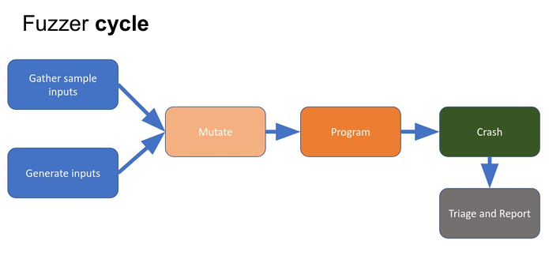
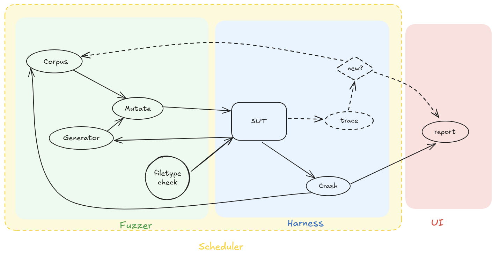

# COMP6447 Fuzzer Assignment


## Assumption

- All binaries **will have a vulnerability** => **result in memory corruption**

- All binaries will also have an associated textfile that can be used as example input into the binary. This input will make the program function normally (return `0`, not crash, no errors).

- All vulnerabilities will result in memory corruption

- All binaries (64 bit) will expect input in one of the following formats:
  - Plaintext (multiline)
  - JSON
  - XML
  - CSV
  - JPEG
  - ELF
  - PDF

### Hints

Bugs might be in the program or the parser

## System diagram of fuzzer





FIXME: `^mowii's aside (see comment)`

FIXME: NOTE to self `(SUT = Software under test)`

## Components of fuzzer

### Harness

- Code coverage

- Statistics

- The thing you use to watch the program behave
  -  Could be a debugger
  - Could be code coverage stuff built into the binary
  - Can use a hypervisor to fuzz an entire system
  - Could just look at the return code after executing the program

- Stuff to look for
  - Crashes
  - Weird program states
  - Code coverage
  - Error messages
  - Information leaks

- Make sure to select the test input for increase in code coverage as a way to break the program!!

- `fork()` is faster than `execve()`
  - Therefore use fork to spawn harness and run harness/code coverage.

- IPC should be a shared memory

- https://aflplus.plus/docs/binaryonly_fuzzing/

- QEMU is faster

#### Question

What format???

### Fuzzer

- Start with mutation-based fuzzer
  - => Find file type
    - => Then becomes generational fuzzer
  - Then optimise code + strategy
    - => Develops into grey box

- Mutation based fuzzing
  - No understanding of structure of input
  - Completely random inputs
  - Add completely random anomalies to existing input
  - Easy and quick to setup

- Generation based fuzzing
  - Generate input based on some format / test case

## File Formats

FIXME: Note from Alex: We can just run `$ file -b --mime-type ...` to determine file type, no need to worry abt magic number, etc. There're only 15 inputs, no need to worry abt performance. Robustness is much more important IMO.

FIXME: Output from `$ file --mime-type ./example_inputs/*`:

```
./example_inputs/csv1.txt:       text/csv
./example_inputs/csv2.txt:       text/csv
./example_inputs/jpg1.txt:       image/jpeg
./example_inputs/json1.txt:      application/json
./example_inputs/json2.txt:      application/json
./example_inputs/plaintext1.txt: text/plain
./example_inputs/plaintext2.txt: text/plain
./example_inputs/plaintext3.txt: application/octet-stream
./example_inputs/xml1.txt:       text/html
./example_inputs/xml2.txt:       text/html
./example_inputs/xml3.txt:       text/html
```

FIXME: Output from `$ file -b --mime-type ./example_inputs/*`:

```
text/csv
text/csv
image/jpeg
application/json
application/json
text/plain
text/plain
application/octet-stream
text/html
text/html
text/html
```

- No magic numbers:
  - Plaintext (multiline)
  - JSON
  - XML

- FIle types with magic numbers:
  - CSV -- i don’t think csv have magic numbers(theyre like json), but could mess around with lf/crlf (unix vs windows format) -- Muhammad
  - JPEG
    - Magic numbers: `FF D8 FF E0`, there are others aswell
  - ELF
    - Magic numbers: `7F 45 4C 46`
  - PDF
    - Magic numbers: `25 50 44 46 2D`

- Figure out type of data.

- Go through each of the file types

---

# TODO

- Get muhammad to implement file formats

- Upload bin files to repo
  - FIXME: Determine

- Language selection:
  - https://www.cardinalpeak.com/blog/faster-python-with-cython-and-pypy-part-2#How_Cython_vs_CPython_Works
  - https://www.youtube.com/watch?v=kz19cJSi9Dc
  - Cython
    - Muhammads request: pls use UV
  - FIXME: Note from Alex: I personally like Rust, it's memory safe (no need to debug tricky memory error), fast and the compiler is actually helpful. If this were an assignment, I would probably use a functional language like Haskell but Rust is a good compromise I guess.

# Meeting

## Meeting location, time and participants

- Location: On campus or Online (Discord voice channel)
- Date & Time: Wednesday, 22 October 2025, 18:00–19:00 (AEST)
- Participants: ジュレスパとマン, mowii, ComputerFido, 5968

## Agenda

- Review current progress on file-type detection module (`file_check` branch)

- Discuss design and feasibility of code coverage / harness implementation

- Decide whether to proceed with Python-only or hybrid (Python + C/C++) implementation

- Plan optimization and integration of Cython for performance

- Assign specific tasks and confirm next meeting time

## Notes

- Docker Compose setup successfully mounts required directories and builds the fuzzer container.

- `file_check` branch now includes initial logic for identifying input file types in Python; further optimization with Cython is pending.

- Team confirmed that each binary includes an example input file -- these can be analyzed to infer input structure or file type.

- JSON/CSV detection is more difficult due to lack of magic numbers; plan to use parsing libraries (`json.loads`, `csv.Sniffer`) and mutation strategies.

- Discussed using **ptrace** / **python-ptrace** or **Frida** for runtime tracing to measure code coverage.

- Considered **drCov** from **DynamoRIO** for collecting address hits, mapping them to disassembly for coverage calculation.

- Concerns raised about runtime overhead and whether coverage metrics can be completed within project timeline.

- Discussed trade-offs between implementing core logic in Python vs C/C++ (Python as wrapper). Decision: begin with Python, optimize with Cython or external binaries later.

- Next group meeting scheduled for Wednesday evening; members available Wed–Sun (except Fri).

## Results

- Fuzzer mutation with simple harness

- Seperate sub-processes! For fuzzer and harness

- Simple scheduler
  - Run the program (harness)
  - Feedback adds to the input corpus
  - When mutation fuzzer run
    - FIXME: Takes

- 3 processes

- Score diffs and make a tree in corpus

- Muhammad => fuzzer part

- Issue how to do mutations?

-Find valid checking => find file type

- Joules:
  - Parse the example file type => JSON/CSV parser

- Muhammad:
  - FIXME: Work on

- JJ: harness

## Action items

### Work to Do

- Frontend/command interface
- Harness
  - Running binary with provided input
  - Capture any crash with ptrace
  - Write a report

- What is the structure of the corpus

- Muhammad
- Lecheng
- Joules
- JJ

---

- （C/C++ ptrace and Python-based ptrace offer the same fundamental capability—attaching to and controlling another process via the kernel ptrace interface—but they differ sharply in ergonomics, performance, and common usage patterns. Using ptrace directly from C or C++ gives you the lowest-level, highest-performance control: you make the raw syscalls, manage waitpid and signal handling yourself, manipulate registers and memory with PTRACE_GETREGS/SETREGS and PTRACE_PEEK/POKE, and can optimize for high-throughput workloads such as tight-loop instrumentation or performance-sensitive fuzzing. That approach requires more boilerplate and deeper OS/ABI knowledge (struct layouts, correct signal forwarding, careful handling of threaded targets, ASLR/PIE address translation, etc.), but it also maximizes determinism and minimizes overhead. By contrast, Python libraries like python-ptrace or rolling your own ctypes wrappers trade raw speed for developer productivity: they wrap many of the tedious details, expose nicer APIs for common tasks (attach, single-step, read/write memory, set breakpoints), and let you prototype complex automation, analysis, or bulk data collection scripts far faster. The Python route is excellent for building PoCs, coordinating fuzzing runs, or integrating with Python ecosystems (pyelftools, capstone, Frida, etc.), but it adds interpreter overhead and sometimes higher latency per operation, which can matter if you need millions of ptrace operations. Both approaches share core challenges—managing waitpid loops and stopped-state semantics, setting and restoring int3 breakpoints correctly, handling threads and signals consistently, and mapping addresses to symbols or source lines via /proc/<pid>/maps and addr2line—but the implementation burden is heavier in C while the runtime cost is higher in Python. A common pragmatic pattern is to isolate the hot-path, low-level tracing in C/C++ (or use efficient dynamic instrumentation frameworks like DynamoRIO or Frida/Stalker) and expose a thin interface that Python can call for orchestration, logging, and data processing; this hybrid gives you the best of both worlds: performance where it matters and rapid iteration where it helps.）

- Add wordlist to test important words
