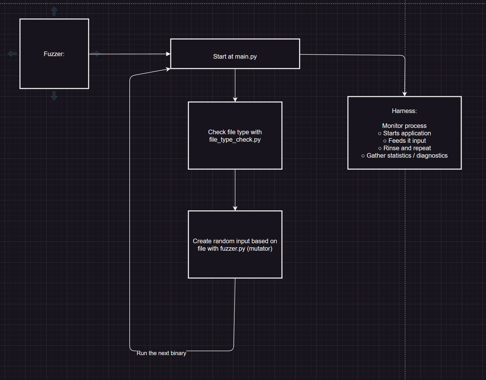

# COMP6447 Fuzzer Assignment

## Assumptions

- Assume input and binary files have the same base name
- Assume input format must be one of `JSON`, `XML`, `CSV`, `JPEG`, `ELF`, `PDF` or `Plaintext`
- Here `Plaintext` is the special non-of-the-above catch-all format
  (see also [Adam's reply](https://discourse02.cse.unsw.edu.au/25T3/COMP6447/t/resolved-plaintext3-is-not-plaintext/92))

## Notes

Some of the notes can be found here:

- https://docs.google.com/document/d/1kjka3ijjtv6MdvxuVZKznp9sHsXN9ch6YZrAvmUkMf8/view

## Github Repo

Source code and other notes can be found here:

- https://github.com/arctic-cheetah/COMP6447-Fuzzer

## System Diagram of Fuzzer

On the high level, the structure of our fuzzer can be approximated by the following system diagram:

## System Overview

### Entry point

Source: `main.py`

This is the python module that starts the entire fuzzer program. It does the following:

1. It runs the harness, then harness deploys SHM memory.
2. For the a given binary and input file, check the file type of the input file
3. Spawn a fuzzer based on the input file type,
4. Run the fuzzer on the example input as a seed, and use mutation strategy from seed to generate random inputs
5. Record the crash in `fuzzer_output/` directory

### File Type Check

Source: `file_type_check.py`

This python module checks the file type of an input when paired with the given binary . It checks whether the input files is either:

- CSV
- JSON
- JPEG
- ELF
- PDF
- XML

If the input file does not match any of the above signatures and structures, then it is considered a Plaintext file

### Mechanism

WIP: switch to using the idiomatic `file -b --mime-type ...` to increase robustness in file type detection

1. Use magic number to determine JPEG, ELF, PDF
2. Use parser to check if it is CSV or JSON
3. Otherwise, we fall back to Plaintext

## Fuzzer

Source: `fuzzer.py`

Fuzzer uses a **mutation**-based strategy to generate malformed/randomised output from valid seeds (input file) to cause crashes or abnormal behavior in target binaries.

Framework is modular:

- The function `run_binary()` handles the binary execution, (WIP: since harness is under work)
- crash detection, and logging,
- Different functions implement different mutator strategies which are chained together to produce randomise malformed output to the target binary

### Mechanism

1. Seed input: Read valid seed files from `example_inputs/` directory.

2. Mutation policy: For each iteration, apply 1 to 6 randomly selected mutators (via composition), such as structural corruption, encoding-boundary stress, random byte insertion, truncation, pattern repetition, and deep nesting.

3. Execution model: Feed mutated inputs to the target binary (via file or stdin) using subprocess.run with a 1-second timeout (TODO: configurable).

4. Crash definition: A run is recorded as a crash if the process times out or exits with a negative return code (terminated by signal). Logged data include exit code, signal, stdout, stderr, and the seed/mutation trace.

5. Artifact preservation: On crash, write the responsible input to `fuzzer_output/bad_{progname}.txt` to satisfy evaluation interfaces and enable deterministic replay.

Mutators with format file specified strategy:

- JSON:
    - unbalanced braces
    - duplicate keys
    - broken escapes
    - illegal Unicode
    - extreme nesting
    - oversized strings.

- CSV:
    - inconsistent columns
    - unusual delimiters
    - long UTF-8 sequences
    - repeated patterns
    - random byte insertions
    - truncations.

## Harness

Source: `hanress.cpp`

WIP: An incomplete implementation is currently used to obtain code coverage, statistics, monitor process and run the binary. It is currently deployed in `fuzzer.py` directly

### Mechanism:

- Start Harness and SHM
- WIP: QEMU?? vs Ptrace
- WIP: Need to implement code coverage

## TODO

Implement mutation strategy pattern for:

- JSON
- JPEG
- ELF
- PDF
- XML
